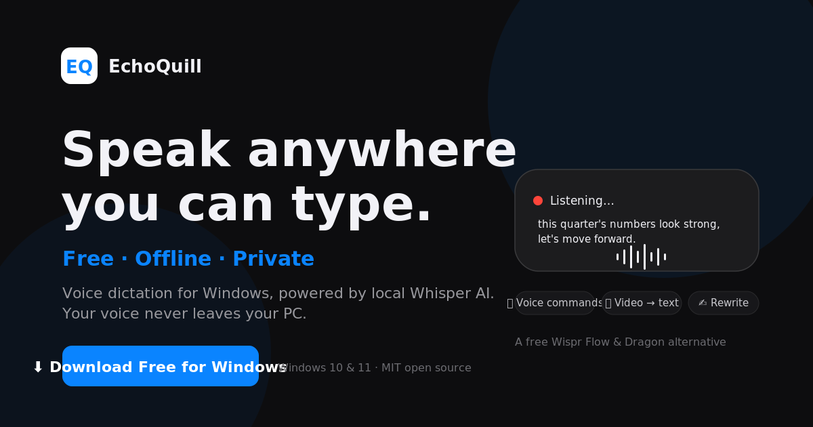
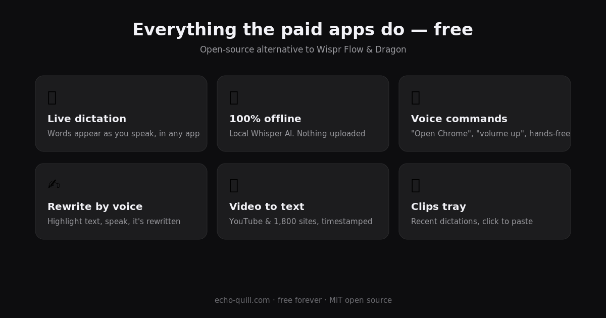

<div align="center">



# 🎙 EchoQuill

### Capture, transcribe & summarize anything you hear or see.

**The private, local Swiss-army knife for voice & video on Windows** — powered by local Whisper AI.
Dictate into any app, transcribe YouTube / Skool / 1,800+ sites, and record meetings & your screen — all on your computer. No subscription. No account. No audio ever uploaded.

[](LICENSE)

-brightgreen)


**[⬇ Download for Windows](../../releases/latest)** · **[Website](https://echo-quill.com)** · **[Report an issue](../../issues)**

*If EchoQuill saves you time, a ⭐ star helps more people find it.*

</div>

## What EchoQuill does

- **Dictation everywhere** — hold a hotkey and talk; text lands in any app. Voice commands & rewrite-by-voice too.
- **Video / URL transcription** — YouTube (incl. Shorts), TikTok, Vimeo, Loom, Wistia and ~1,800 sites. **Skool support built in**: paste the lesson's video link or a signed `.m3u8` (auto-adds the Referer), or sign in via your browser for member-only videos.
- **Keep the media** — optional "Keep audio file" / "Keep video file" so you save the download, not just the transcript. Name any transcript yourself.
- **Meeting / Record** *(Pro)* — record what you HEAR on your PC (calls, webinars, any playing video), optionally your mic, and even **capture the full screen as MP4** — then transcribe & summarize it locally. No link, no DevTools.
- **AI, your way** — cleanup, formatting & summaries via Ollama (100% local), Ollama Cloud, Claude, OpenAI, Groq, DeepSeek, Qwen or Z.AI. Off by default.
- **Clips tray, editable history, favorites, search** — click a clip to paste at your cursor; edit & re-save any past transcription; ★ favorite the good ones.
- **Organized output** — everything saves under `Documents/EchoQuill/` (Transcriptions, Meetings, …).
- **Private & free** — 100% local unless you enable a cloud provider. Keys stored in Windows Credential Manager. Free forever for dictation.

<div align="center">

</div>

---

## Why EchoQuill?

Speaking is about three times faster than typing — and the paid dictation apps know it, charging every month while routing your voice through their servers. EchoQuill does what they do, free and fully offline, with a few things they don't do at all.

| | EchoQuill | Wispr Flow | Dragon |
|---|---|---|---|
| Price | **Free forever** | $12+/mo | $200–700 |
| Works offline | **Yes** | No | Partly |
| Voice leaves your PC | **Never** | Yes | Configurable |
| Open source | **Yes (MIT)** | No | No |
| Live words as you speak | **Yes** | Yes | Yes |
| Voice-control your PC | **Yes** | No | Yes |
| Rewrite selected text by voice | **Yes** | Yes | Limited |
| Video / YouTube transcription | **Yes** | No | No |
| Batch-transcribe a list of URLs | **Yes** | No | No |
| Timestamped transcript search | **Yes** | No | No |
| Clipboard manager with drag & drop | **Yes** | No | No |
| Click a clip to paste at your cursor | **Yes** | No | No |
| Edit & manage your transcription history | **Yes** | No | No |
| Learning dictionary | **Yes** | Yes | Yes |
| Per-app tone & formatting | **Yes** | Yes | No |
| Choose your AI (Claude, OpenAI, Groq, Ollama…) | **Yes** | No | No |
| Light / dark / system theme | **Yes** | Yes | Yes |
| One-click self-update | **Yes** | Yes | Yes |

<div align="center">

</div>

## What it does

**🎙 Live dictation, anywhere.** Press `Ctrl+Alt+Space`, talk, and your words appear live in a floating pill, then land wherever your cursor is — email, Word, browsers, chat, code editors. Prefer push-to-talk? Hold Right Alt instead. Press `Esc` to cancel mid-sentence.

**🎧 Voice-control your PC.** Say *"computer, open Chrome"*, *"search for foreclosure listings"*, *"press enter"*, *"volume up"*, *"lock the computer"*. Recognition is primed with the command vocabulary, and only a fixed, safe list of actions can ever run — a misheard word can't do anything destructive.

**✍ Rewrite anything by voice.** Highlight text in any app, press `Ctrl+Alt+W`, and say *"make this more professional."* The selection is rewritten in place.

**🎬 Turn videos into text.** Paste a link from YouTube (including Shorts), TikTok, and ~1,800 other sites, or pick any media file. Transcripts auto-save, named after the video, with title and URL on top. **Batch mode** chews through a whole list of URLs unattended, with a Stop button any time. Search a transcript and matches report *when* they were said: `4 matches — at 02:14, 05:37, 11:02`.

**📋 Clips & history you control.** Recent dictations live in a draggable floating tray — **click a clip and it pastes straight into whatever field your cursor is in**, or drag it into a specific spot. A full transcription browser lets you search, multi-select, delete, and — unique among dictation apps — **edit the text of any past transcription and save it back**.

**📖 A dictionary that learns.** Names, jargon, and brands always come out right — add, **edit**, or remove entries, and repeated corrections become dictionary entries automatically.

**🤖 Optional AI cleanup & formatting.** Off by default. Plug in Anthropic Claude, OpenAI, Groq, Ollama (free, local), Ollama Cloud, DeepSeek, Qwen, or Z.AI (GLM) to structure your dictation — turn a spoken email into a proper email, or spoken notes into bullet points — with different behavior per app. Your keys are stored in Windows Credential Manager.

**🎨 Your look.** Dark, light, or follow-system theme.

**🔒 Optional audio history.** Keep a private local recording of each dictation, with a storage budget and one-click ZIP export. Off by default.

**⬆ Updates itself.** One click in Settings → About when a new version ships.

Plus: spoken punctuation, mic lock, media ducking, never-miss-the-first-word cueing, adjustable tail capture, daily/weekly/monthly stats, full data export, administrator-mode for elevated apps, and a first-run tour so you're dictating in under a minute.

## Install (30 seconds)

1. Download **EchoQuill-Setup.exe** from the [latest release](../../releases/latest).
2. Run it (Windows may warn about an unrecognized app — click *More info → Run anyway*; the entire source is right here for inspection).
3. Press `Ctrl+Alt+Space` and start talking.

Requirements: Windows 10/11 and a microphone. First dictation downloads a speech model (~140 MB) once; after that it's fully offline. An NVIDIA GPU makes it faster but isn't required.

## Privacy, verifiable

- Voice, transcripts, history, dictionary: **processed and stored only on your computer**.
- **Zero** analytics, telemetry, or tracking — read the code, it's all here.
- Network is used only for one-time model downloads, video URLs *you* paste, update checks, and AI providers *you* enable with your own key.

Details: [SECURITY.md](SECURITY.md)

## EchoQuill Pro

Free covers unlimited dictation forever, 5 video transcriptions, and your last 10 clips. **Pro** — unlimited video transcription, drag-and-drop file upload, an unlimited clip library with a Favorites tab, **Ask AI about any video** (answers grounded in the transcript, with timestamps), and priority support — is coming soon at **$5/month or $39/year** at [echo-quill.com](https://echo-quill.com/#pricing). Star + Watch this repo to catch the launch.

## Building from source

```bash
git clone https://github.com/CFRE-dotcom/echoquill.git
cd echoquill
install.bat        # one-time dependency setup (Python 3.10+)
EchoQuill.bat      # run from source
build_exe.bat      # or build your own EchoQuill.exe
```

Releases are compiled automatically by GitHub Actions from the tagged source — what you download is what you see here.

## Contributing

Issues and PRs welcome. One focused change per PR; open an issue first for anything non-trivial.

## License & credits

[MIT](LICENSE) — free for everyone, forever.
Speech recognition: [OpenAI Whisper](https://github.com/openai/whisper) via [faster-whisper](https://github.com/SYSTRAN/faster-whisper) · Video downloads: [yt-dlp](https://github.com/yt-dlp/yt-dlp) · Inspired by [FluidVoice for macOS](https://github.com/altic-dev/FluidVoice) (independent project, not affiliated).
